# Comparison of EM simulations
This repository contains cases comparing electromagnetic (EM) solutions generated by three finite element (FE) solvers, [MOOSE](https://mooseframework.inl.gov/ "MOOSE"), [NGSolve](https://ngsolve.org/ "NGSolve"), and [COMSOL](https://www.comsol.com/ "COMSOL"). MOOSE and NGSolve are open-source solvers, while COMSOL is a commercial FE solver. The notation used here is from [Dular's thesis](https://orbi.uliege.be/handle/2268/298054 "Dular's thesis").

## Geometry and mesh

The geometry consists of a block with the side length of 0.20 m and a coil with 1.5 turns and the cross section of 0.005 m radius.

The same mesh was used for all simulations. This mesh was generated in COMSOL and exported in [Nastran .nas format](https://doc.comsol.com/6.4/doc/com.comsol.help.comsol/comsol_ref_mesh.24.31.html#562174 "Nastran .nas format"). The exported mesh was converted to Gmsh format using [Gmsh](https://gmsh.info/  "Gmsh"); Gmsh GUI was used. Figure 1 shows the COMSOL-generated mesh.

<figure>
  

    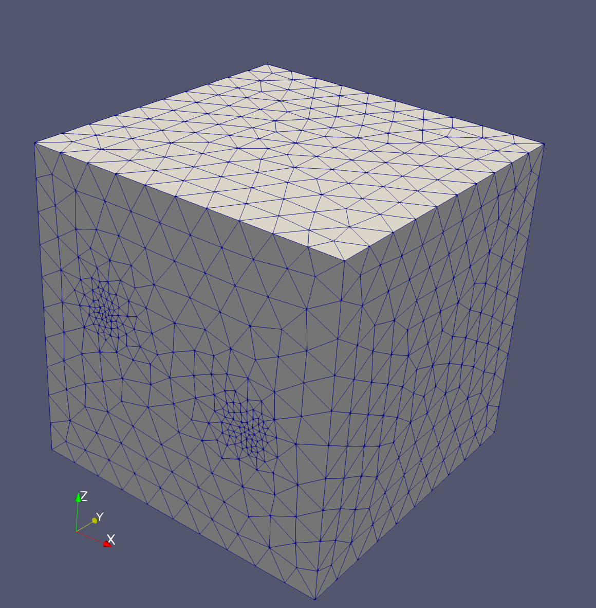
    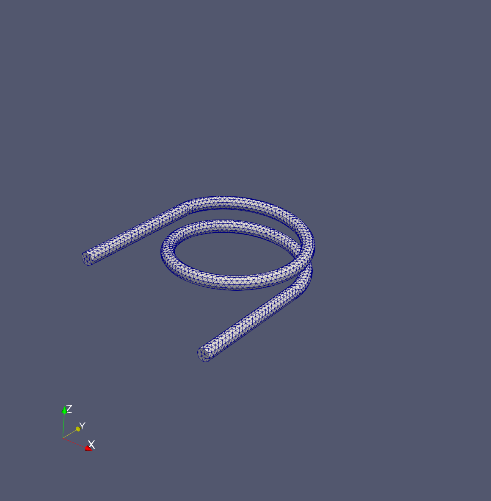
  

  <figcaption style="text-align: center;">
  Figure 1: Overall box mesh (left) and extracted coil mesh (right).
  </figcaption>
</figure>

## Repository structure

* [meshes](./meshes) stores all generated meshes.
* [scripts](./scripts) stores case-specific Python run files for MOOSE and NGSolve. It also stores case-specific COMSOL models with `.mph` extension. 
* [input_moose](./input_moose) stores MOOSE run files with `.i` extension. They are used in relevant Python files in [scripts](./scripts).
* [output](./output) stores case-specific solutions.

## Case 1 - Electrostatic problem

### Problem outline

In this problem, electric potential and current density are produced in the coil. A potential problem is solved to determine electric potential $V$ and then calculate electric current density $j$ within the coil domain $\Omega_{\text{coil}}$. The following equations apply:

<!--
$$
\bm{j} = \sigma \bm{e} \\
\bm{e} = - \nabla V \\
\operatorname{div} j = 0 \tag{1}
$$
-->

  

  

  

where $\sigma$ are $e$ are electric conductivity and electric field.

Port boundary conditions (BCs) are defined as follows: 
<!-- $$
V = 0  \qquad \qquad \text{on } \Gamma_{\text{out}}  \\
j_n = \frac{I_{coil}}{|\Gamma_{in}|} \quad \qquad \text{on } \Gamma_{\text{in}} \tag{2}
$$ -->

  

  

where $\Gamma_{\text{in}}$ and $\Gamma_{\text{out}}$ is the coil's input and output cross sections, and $I_{coil}$ is the applied input current. Eqs. 1 and 2 are solved to obtain $V$, and then $j$ is calculated from $V$.

For this case, $I_{coil} = 2191.9 \; A$, and $\sigma_{coil} = 62.83185 \; S/m$. The space surrounding the coil is assumed to be vacuum.

### Results

#### Match overview
* Electric potential ($V$)

   ✅ NGSolve-COMSOL

   ✅ NGSolve-MOOSE

   ✅ MOOSE-COMSOL

* Current density ($J$)

   ✅ NGSolve-COMSOL

   ✅ NGSolve-MOOSE
   
   ✅ MOOSE-COMSOL

#### Relative errors (absolute errors could be found in the error Jupyter notebooks located in case specific scripts)

Electric potential errors between MOOSE and NGSolve: ​
* Max. relative error : 8.060e-11 %
* Avg. relative error : 6.317e-11 %

Current density errors between MOOSE and NGSolve:
* $x$ direction
   * Max. relative error : 1.231e-05 %
   * Avg. relative error  : 2.133e-08 %
* $y$ direction
   * Max. relative error : 4.613e-09 %
   * Avg. relative error : 5.632e-11 %
* $z$ direction
   * Max. relative error : 2.108e-05 %
   * Avg. relative error : 2.406e-08 %

Electric potential errors between NGSolve and COMSOL:
* Max. relative error : 6.656e-03 %
* Avg. relative error : 1.309e-05 %

Current density errors between NGSolve and COMSOL:
* $x$ direction
  * Max. relative error : 3.777e+13 % ​
  * Avg. relative error : 1.101e+10 %
* $y$ direction
  * Max. relative error : 2.818e+00 % ​
  * Avg. relative error : 7.288e-03 % ​
* $z$ direction
  * Max. relative error : 6.749e+13 %​
  * Avg. relative error : 2.716e+10 %

#### Analysis

Electrical potential achieves exact match for all three FE solvers with vanishingly small relative errors.

The relative current density errors between NGSolve and COMSOL might seem high, particularly in $x$ and $z$ directions. However, only a small percentage of Gauss points in the vicinity of $\Gamma_{\text{in}}$ have extremely high errors, which bears significant negative influence on the average error values. Indeed, Figure 2 shows histogram of relative current density error values, and Figure 3 shows these values as a point cloud. The percentage of points with error values above 10% is only 2.05% in $x$ direction, 0.0% in $y$ direction, and 2.15% in $z$ direction. Furthermore, even error value histograms show that majority of values are below 0.1%.

Since electric potential values match exactly across the board for all three solvers, locally high current density differences could be attributed to COMSOL performing gradient operation differently to NGSolve and MOOSE. In particular, COMSOL might be performing some additional intrinsic post-processing operations. 

<figure>
  

    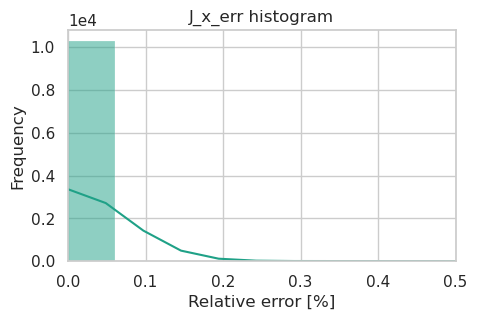
    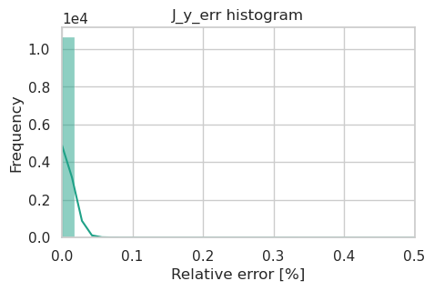
   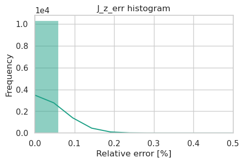
  

  <figcaption style="text-align: center;">
  Figure 2: Histograms of the NGSolve-COMSOL relative current density error values.
  </figcaption>
</figure>

<figure>
  

    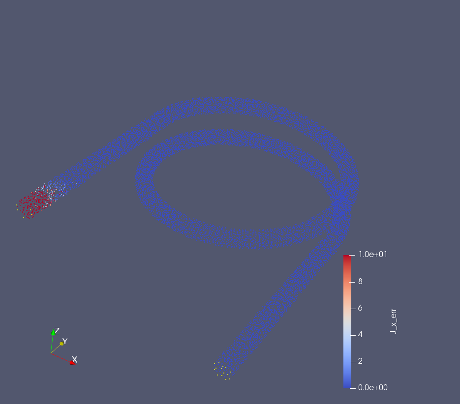
    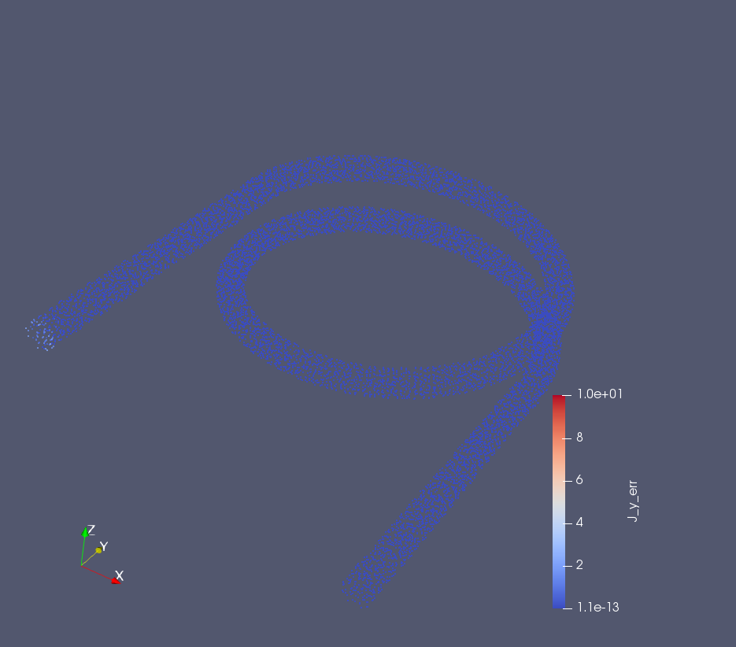
   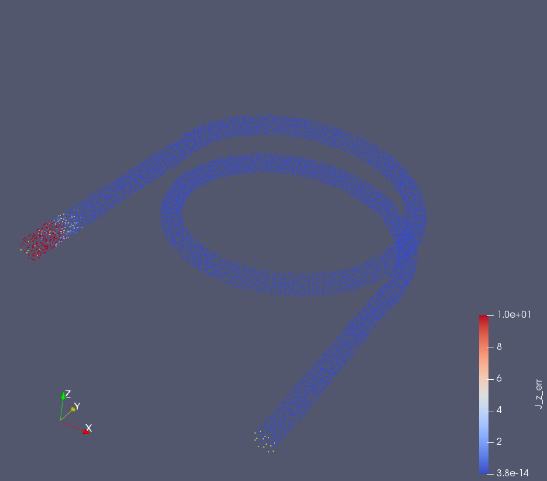
  

  <figcaption style="text-align: center;">
  Figure 3: NGSolve-COMSOL relative current density error values as a point cloud, the colour scale is from 0 to 10.
  </figcaption>
</figure>

## Case 2 - Magnetostatic problem

### Problem outline

The current density produced in the coil (Case 1) is applied as a source. Maxwell’s equations are resolved through $a$-formulation where the following applies:

<!-- $$
\operatorname{\mathbf{curl}} \bm{a} = \bm{b} \tag{3}
$$ -->

  

where $\bm{a}$ and $\bm{b}$ are vector potential and magnetic flux density, respectively.

Ampère's law is employed:
<!-- $$
\operatorname{\mathbf{curl}} \bm{h} = \bm{j} \\
\bm{j} = \sigma \bm{e} \\
\bm{b} = \mu \bm{h} \tag{4}
$$ -->

  

  

  

where $h$ and $\mu$ are magnetic field and permeability, respectively.

For this case, $I_{coil} = 2191.9 \; A$, $\sigma_{coil} = 62.83185 \; S/m$, whereas $\mu = 0 \; H/m$ for all materials. The space surrounding the coil is assumed to be vacuum.

### Results

Here, the difference between $b$ values at Gauss points are compared. Gauss point locations and corresponding values can be directly extracted in NGSolve and COMSOL. However, it is currently not possible to do in MOOSE with MFEM. Consequently, the locations were extracted in NGSolve and COMSOL, compared to ensure that they exactly match, and then they were loaded into MOOSE point sampler to sample the solution.

#### Match overview
* Magnetic flux density (B)

   ✖️ NGSolve-COMSOL 

   ✅ NGSolve-MOOSE
   
   ✖️ MOOSE-COMSOL

#### Relative errors (absolute errors could be found in the error Jupyter notebooks located in case specific scripts)

Magnetic flux density errors between MOOSE and NGSolve:
* $x$ direction
  * Max. relative error : 1.182e+04 %​
  * Avg. relative error : 2.087e+00 %
* $y$ direction
  * Max. relative error : 4.883e+04 %
  * Avg. relative error : 5.691e+00 %
* $z$ direction
   * Max. relative error : 1.367e+04 %
   * Avg. relative error : 2.053e+00 %

Magnetic flux density errors between NGSolve and COMSOL: ​
* $x$ direction
  * Max. relative error : 2.325e+05 %
  * Avg. relative error : 4.392e+01 %
* $y$ direction
  * Max. relative error : 8.055e+05 %
  * Avg. relative error : 8.008e+01 %​
* $z$ direction
  * Max. relative error : 1.770e+06 %
  * Avg. relative error : 2.326e+02 %

#### Analysis

Figure 4 and 5 show the comparison of magnetic flux density fields produced by NGSolve and MOOSE. It can be seen that locally high error values are observed in the vicinity of $\Gamma_{\text{in}}$ and $\Gamma_{\text{out}}$. However, the percentage of points with error values above 10% is only 2.01% in $x$ direction, 4.1% in $y$ direction, and 2.24% in $z$ direction. Furthermore, even error value histograms show that majority of values are well below 1%.

<figure>
  

    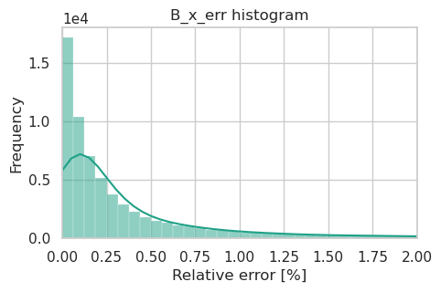
    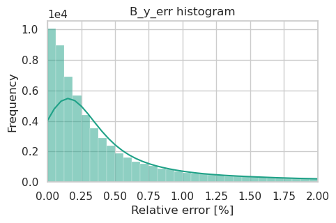
   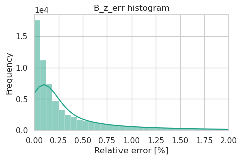
  

  <figcaption style="text-align: center;">
  Figure 4: Histograms of the NGSolve-MOOSE relative magnetic flux density error values.
  </figcaption>
</figure>

<figure>
  

    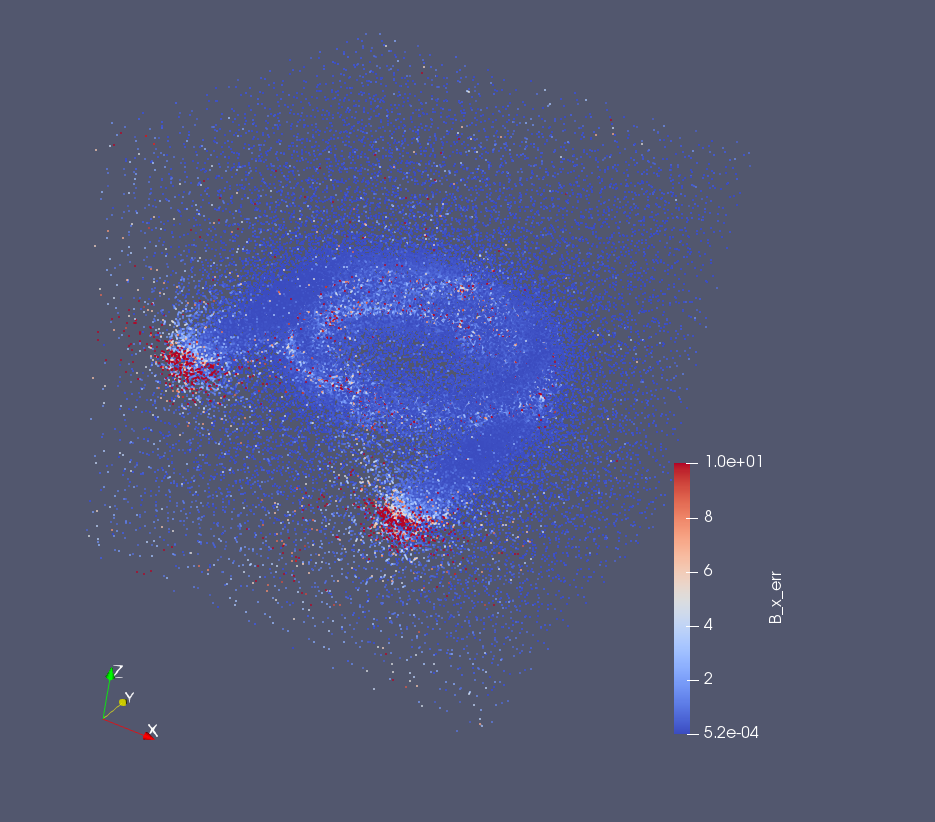
    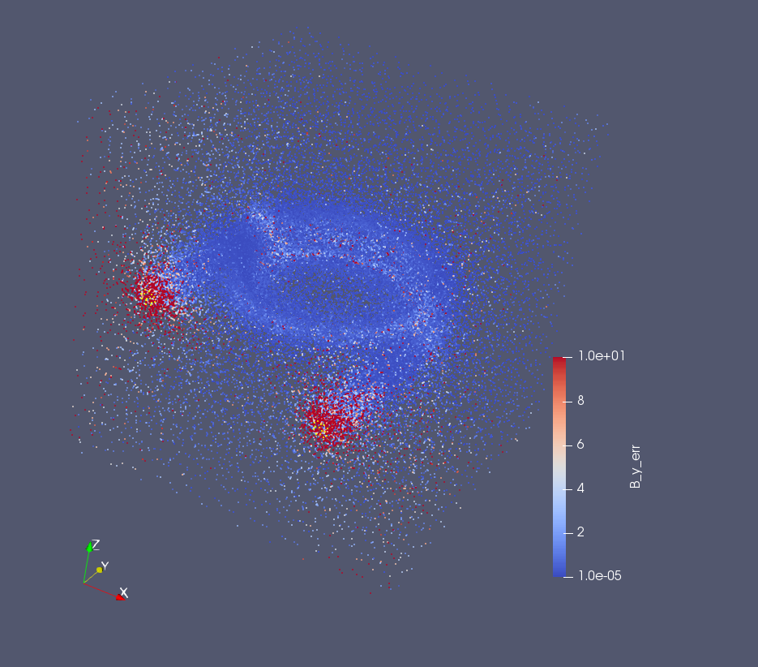
   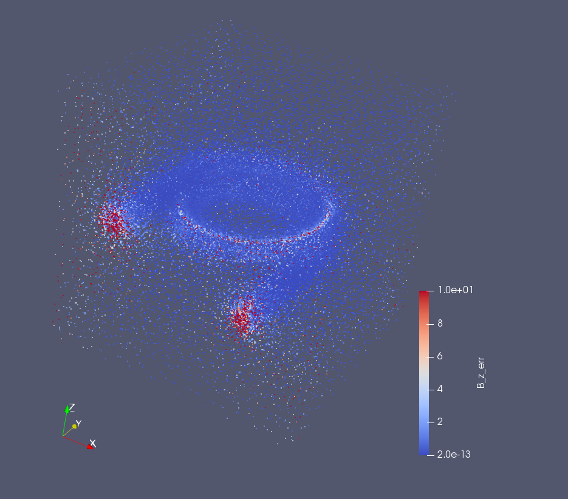
  

  <figcaption style="text-align: center;">
  Figure 5: NGSolve-MOOSE relative magnetic flux density error values as a point cloud, the colour scale is from 0 to 10.
  </figcaption>
</figure>

The situation is considerably less positive when comparing the results from COMSOL and NGSolve, as it is shown in Figures 6 and 7.

<figure>
  

    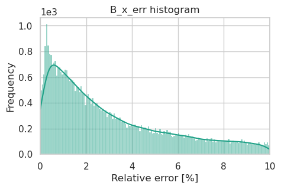
    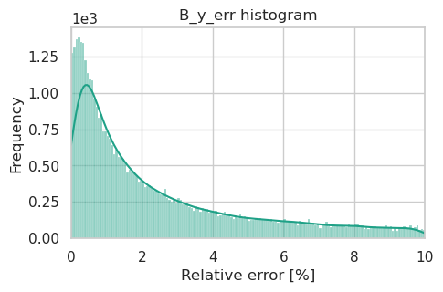
   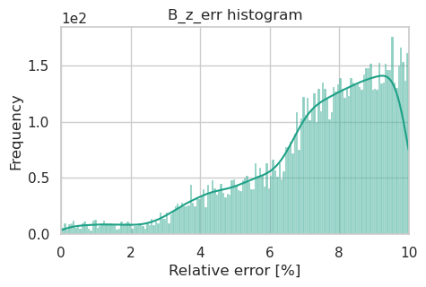
  

  <figcaption style="text-align: center;">
  Figure 6: Histograms of the NGSolve-COMSOL relative magnetic flux density error values.
  </figcaption>
</figure>

<figure>
  

    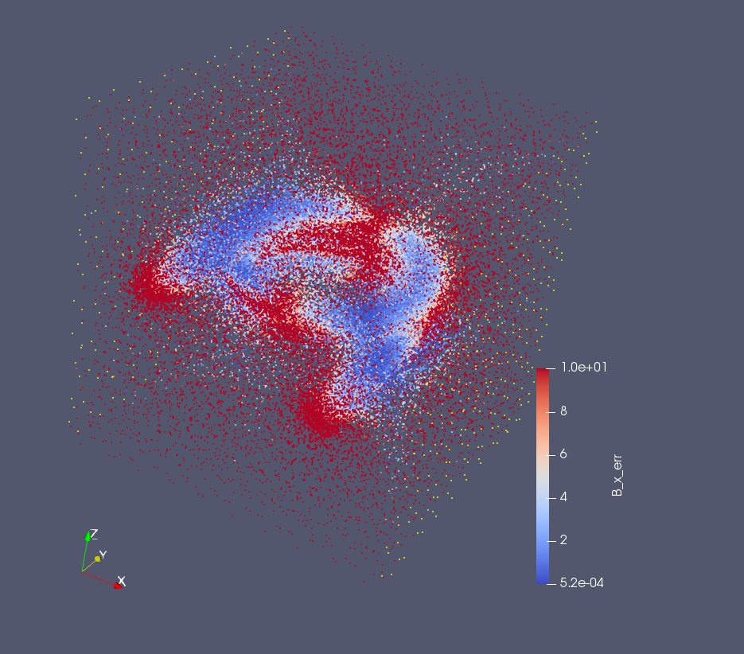
    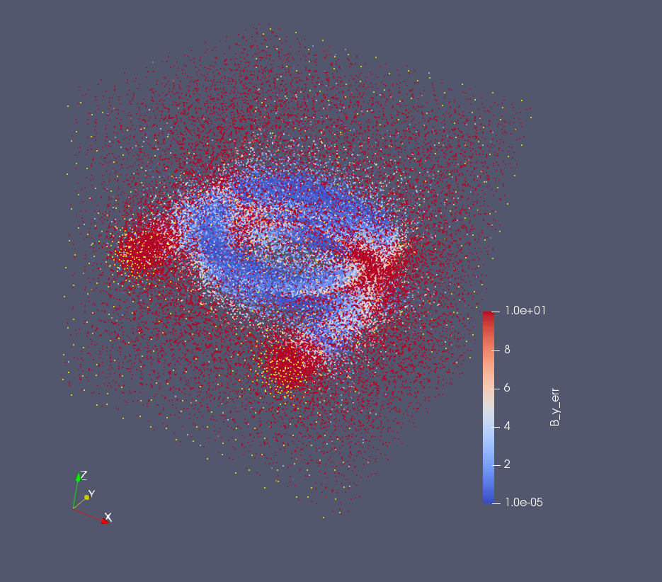
   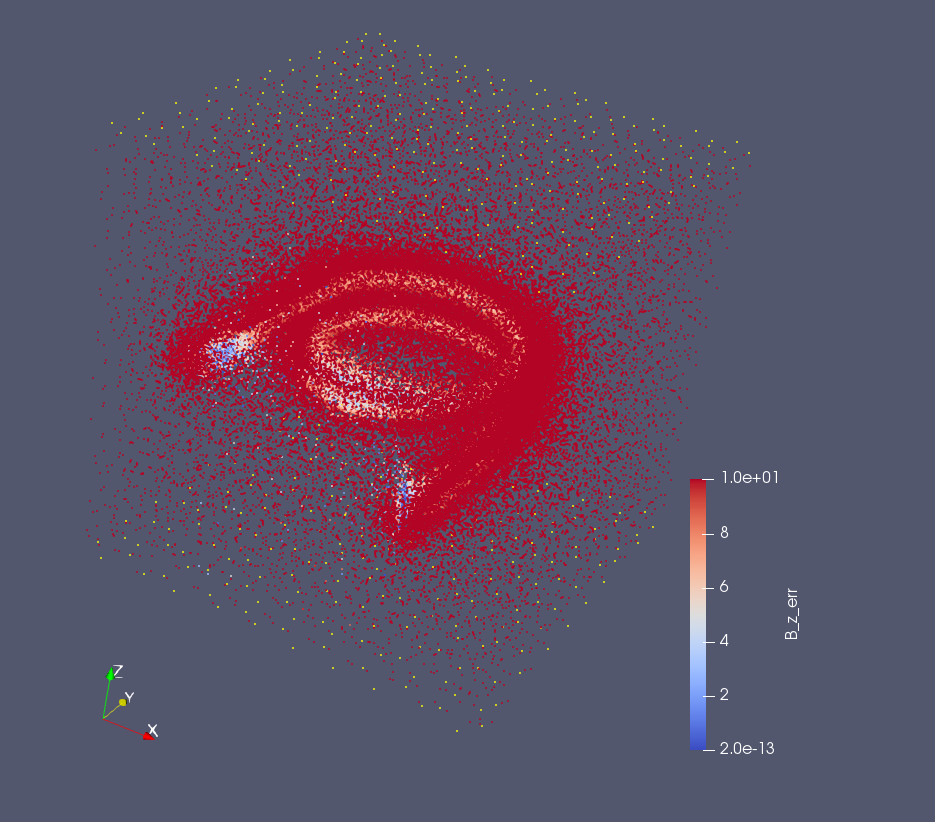
  

  <figcaption style="text-align: center;">
  Figure 7: NGSolve-COMSOL relative magnetic flux density error values as a point cloud, the colour scale is from 0 to 10.
  </figcaption>
</figure>

However, in spite of these errors the solutions are visually similar if compared in ParaView, as shown in Figure 8.

<figure>
  

    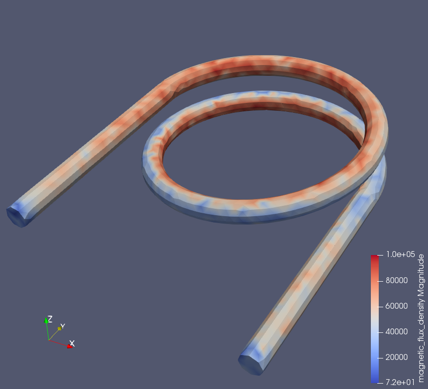
    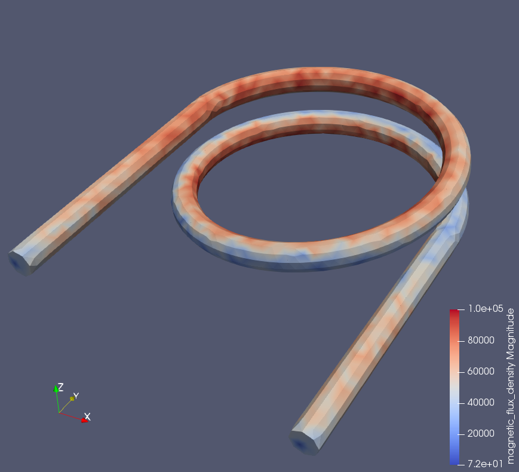
   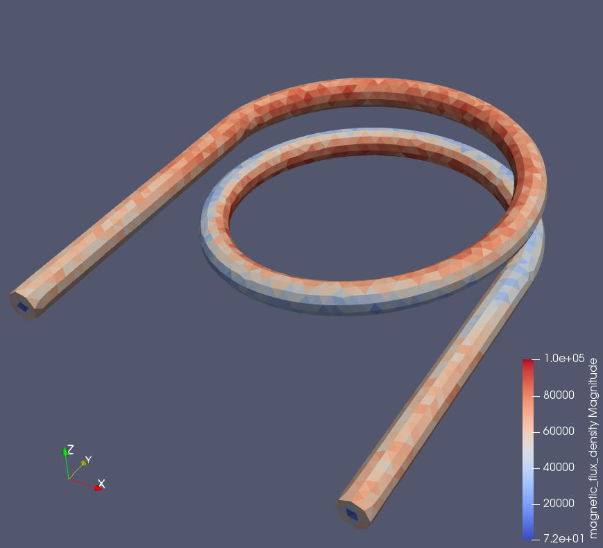
  

  <figcaption style="text-align: center;">
  Figure 8: Magnetic flux density for NGSolve (left), MOOSE (middle), and COMSOL (right) with the same colour scale.
  </figcaption>
</figure>
